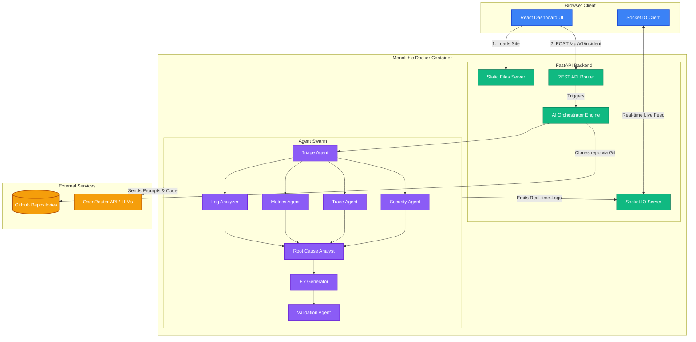

# SwarmOps 🐝

**SwarmOps** is an advanced, multi-agent AI incident response and root-cause analysis platform. It leverages a swarm of specialized AI agents that automatically investigate backend incidents, analyze system metrics, diagnose code-level bugs, and generate deployable Git patches in real-time.

🚀 **Live Demo:** [https://swarmops-1.onrender.com](https://swarmops-1.onrender.com)

## 🧠 Concept & Architecture

When a production system throws an alert or an incident is reported, the traditional approach requires on-call engineers to manually sift through logs, metrics, traces, and code. SwarmOps automates this entirely using a **Sequential AI Swarm Pipeline**:

1. **Triage Agent**: Initially classifies the incident and determines severity.
2. **Log Analyzer Agent**: Scans application logs for exceptions, stack traces, and anomalies.
3. **Metrics Agent**: Analyzes CPU, Memory, and application latency metrics.
4. **Trace Agent**: Investigates distributed traces to find network bottlenecks or database deadlocks.
5. **Security Agent**: Checks if the incident is a result of a vulnerability or malicious attack.
6. **Root Cause Agent**: Synthesizes all findings from the previous agents into a definitive root cause analysis.
7. **Fix Generator Agent**: Writes the actual code to fix the bug (generates a `git` patch).
8. **Validation Agent**: Ensures the proposed fix is logical and passes basic sanity checks.

As the agents work, they stream their progress in **real-time** over WebSockets to the SwarmOps React Dashboard, giving the user a live view of the AI "thinking" through the problem.

### System Diagram



## 🛠 Tech Stack

### Backend (AI Pipeline & API)
* **Python 3.11+**
* **FastAPI**: High-performance async web framework.
* **Socket.IO**: Real-time event streaming.
* **OpenRouter**: The LLM engine powering the agents.
* **Docker**: Containerized deployment environment.

### Frontend (Real-time Dashboard)
* **React + Vite**: Blazing fast frontend build tool.
* **Tailwind CSS**: Utility-first styling.
* **Framer Motion**: Smooth, high-performance animations.

## 🚀 Getting Started (Local Development)

### 1. Setup Backend
```bash
cd backend
python -m venv .venv
source .venv/bin/activate
pip install -r requirements.txt
```

Create a `.env` file in the `backend` folder:
```ini
OPENROUTER_API_KEY=your_api_key_here
```

### 2. Setup Frontend
```bash
cd frontend
npm install
npm run build
```

### 3. Run the Monolith
The FastAPI backend serves the compiled React frontend automatically.
```bash
cd backend
uvicorn main:app --host 0.0.0.0 --port 8000 --reload
```
Open `http://localhost:8000` in your browser.

## ☁️ Deployment

SwarmOps is configured as a **Single-Container Monolith** using a multi-stage Dockerfile. This means the React frontend and Python backend are built and hosted together in the exact same container.

To deploy on Render:
1. Create a new **Web Service**.
2. Connect your GitHub repository.
3. Set the **Root Directory** to `backend`.
4. Set the **Dockerfile Path** to `Dockerfile`.
5. Add the `OPENROUTER_API_KEY` Environment Variable.

Render will automatically run the multi-stage build (compiling the React app and installing the Python dependencies) and serve the unified application.

## 🤝 Contributing
Contributions, issues, and feature requests are welcome! Feel free to check the issues page.
